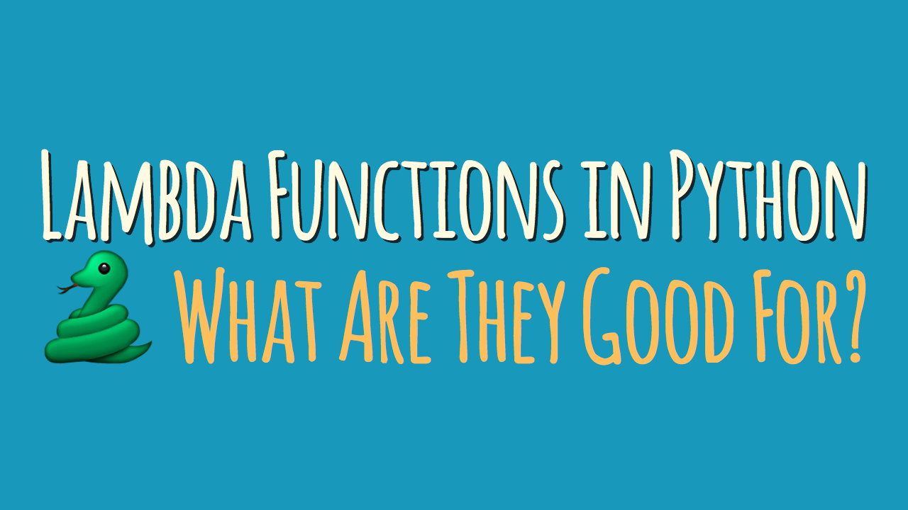

# OOP (Object-oriented programming)

Object-oriented programming is a **programming paradigm** that provides a means of structuring programs so that properties and behaviours are bundled into individual **objects**.

These objects contain data (attributes) and behaviour (methods) and interact with each other to accomplish tasks.

For instance, an object could represent a person with properties like a name, age, and address and behaviors such as walking, talking, breathing, and running.


### In other words:
***Object-oriented programming*** is an approach for modeling concrete, real-world things, like cars, as well as relations between things, like companies and employees, students and teachers, and so on. 

---


In the diagram bellow we can see how classes **inherit** attributes and behaviours.
### In this case top to bottom fashion.


---
# OOP Four Pillars


- Abstraction
- Inheritance
- Encapsulation 
- Polymorphism

---
###  ***1.Abstraction***


**Abstraction** in Python is defined process of handling complexity by hiding unnecessary information from the user. 

This is one of the core concepts of ***OOP***.

**A quick example**:  When we use a TV remote to increase the volume, we don't know how pressing a key increases the volume of the TV. We only know to press the `+` button.

---

### 2. ***Inheritance***


**Inheritance** allows us to define a class that inherits all the methods and properties from another class.

Parent class is the class being inherited from, also called base class. Child class is the class that inherits from another class, also called derived class.

**A quick example**: A child inherits the traits of his/her parents. With inheritance, we can reuse the fields and methods of the existing class. Hence, inheritance facilitates re-usability and is an important concept of OOP.

---

### ***3.Encapsulation***

**Encapsulation** is a mechanism of wrapping the data (variables) and code acting on the data (methods) together as a single unit. In encapsulation, the variables of a class will be hidden from other classes, and can be accessed only through the methods of their current class.

---

### ***4. Polymorphism***


The word **“polymorphism”** means having many forms. In simple words, we can define polymorphism as the ability of a message to be displayed in more than one form.

**A quick example**: A real-life example of polymorphism is a person who at the same time can have different characteristics.

---

## Key benefits of using OOP
- Modularity for easier troubleshooting
- Reuse of code through inheritance
- Flexibility through polymorphism
- Effective problem-solving


# lambda function

**lambda** is a keyword in Python for defining the anonymous function.

A lambda function can take any number of arguments, but can only have one expression.

### **syntax:**

```
lambda arguments : expression
```



### Why use `lambda`?

The power of lambda is better shown when you use them as an anonymous function inside another function.

You should use the lambda function to create simple expressions. For example, expressions that do not include complex structures such as if-else, for-loops, and so on.

### Use cases

One of the most common use cases for lambdas is in ***functional programming*** as Python supports a paradigm of programming referred to as functional programming. It allows you to ***supply a function as a parameter to a different function*** (for example, in map, filter, etc.).

---

# Classes and instances

### 1.**Classes**

Classes are used to create user-defined data structures. Classes define functions called **methods**, which  indentify the behaviours and actions that an object created from the class can perform with its data.

***A class*** is a ***blueprint*** for how something should be defined. It doesn't actually contain any data.

### 2. **Instances**

While a class is ***blueprint***, an ***instance*** is an object that is built from a class and contains **real data**.

### *Put another way...*
A ***class*** is like a form or questionare. An ***instance*** is like form that has been filled out with information. 

Just like many people can fill out the same form with their own unique information, many instances can be created from a single class.

---

## How to define a class

All class definitions start with the `class` keyword, which is followed by the name of the class and a `:` colon.

Any code that is indented below the class definition is considered part of the class's body. 

### *Example of a `class` called Dog:*

``` 
class Dog:
    pass
```

The body of this *Dog* class only contains a single statement `pass`. 

`pass` keyword is often used as a **placeholder**. It allows us to run the code without receiving an error.

So far this `class` isn't very interesting, but we can define a number of **properties**, such as:

- name
- coat colour
- breed

The properties that all `Dog` objects must have are defined in a method called `__init__()`.

Every time a new `Dog` object is created, `__init__()` sets the initial **state** of the object by assigning the value of the object's properties